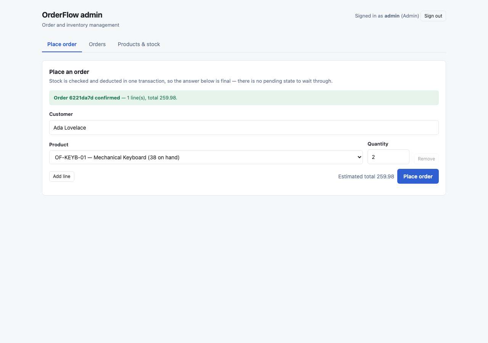
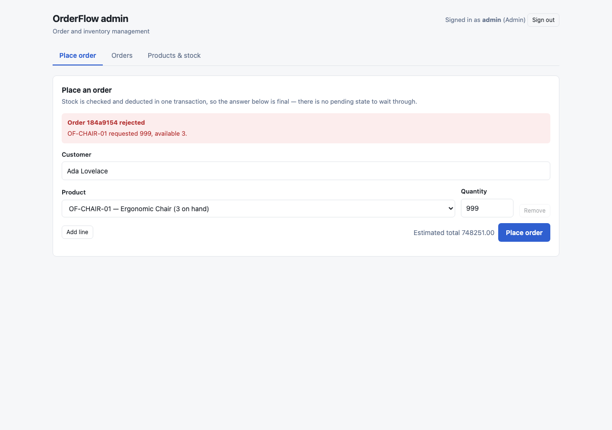
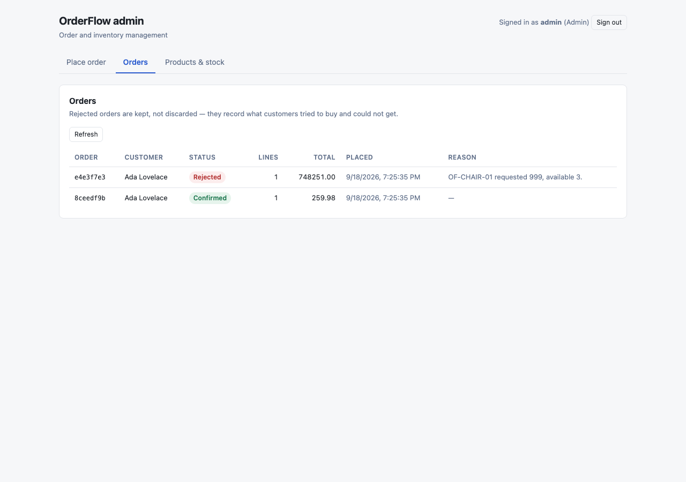
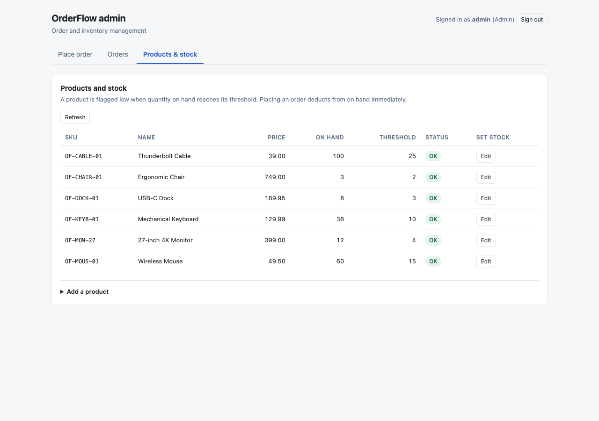
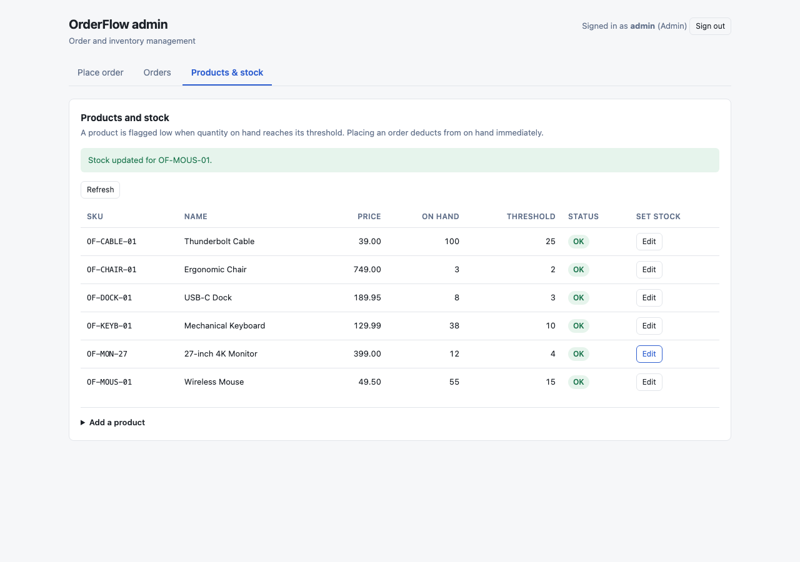

# OrderFlow

[](https://github.com/jitani04/OrderFlow/actions/workflows/ci.yml)

A full-stack order and inventory management application: an ASP.NET Core API over
PostgreSQL with a React and TypeScript front end, containerized with Docker and deployable
to Kubernetes.

The interesting part is **order placement**: checking stock, deducting it and recording the
order all happen inside a single database transaction with the stock rows locked, so two
customers racing for the last item cannot both win.

---

## Screenshots

| Placing an order | Rejected for insufficient stock |
|---|---|
|  |  |

| Orders — filtered and paged | Products and stock |
|---|---|
|  |  |

Editing stock sends the version it was based on, so a concurrent change is refused rather
than silently overwritten:



---

## What it does

- Keeps a catalogue of products, each with a stock level and a low-stock threshold.
- Accepts orders. An order is filled completely or not at all: if any line is short, no
  stock moves and the order comes back `Rejected` naming what was missing.
- Authenticates with JWT bearer tokens against a seeded admin account.
- Validates every request and returns RFC 7807 problem details when something is wrong.

---

## Architecture

A single service, cleanly layered. Dependencies point inward — `Api` and `Infrastructure`
both know about `Domain`; `Domain` knows about nothing.

```
  React admin panel  ──▶  ASP.NET Core Web API  ──▶  PostgreSQL
                          (JWT auth, EF Core)
```

| Project | Holds | Depends on |
|---|---|---|
| `OrderFlow.Domain` | Entities, enums, the stock reservation rules | *nothing* |
| `OrderFlow.Infrastructure` | DbContext, migrations, repositories, transactional order placement | Domain |
| `OrderFlow.Api` | Controllers, DI, auth, validation, Swagger | Domain, Infrastructure |
| `OrderFlow.Tests` | Unit and integration tests | all of the above |

`OrderFlow.Domain` has **no package references at all**. That is enforced by its `.csproj`
rather than by convention, and it is what keeps the business rules testable in milliseconds
without a database.

---

## Tech stack

| Concern | Choice |
|---|---|
| Runtime | .NET 10 (LTS) |
| Web | ASP.NET Core Web API, controllers |
| Data | EF Core 10 + Npgsql, PostgreSQL 16 |
| Auth | JWT bearer, BCrypt password hashing |
| Validation | FluentValidation |
| Logging | Serilog (structured, console) |
| Docs | Swashbuckle / Swagger UI |
| Tests | xUnit v3, FluentAssertions, Testcontainers |
| Frontend | React 19 + TypeScript + Vite |
| Deploy | Docker, docker-compose, Kubernetes |

Every version is pinned centrally in [`Directory.Packages.props`](Directory.Packages.props),
so no project can drift onto a different version of a shared dependency.

> **Note on .NET 10 vs .NET 8** — the original spec pinned .NET 8. .NET 10 is the current
> LTS (Nov 2025 – Nov 2028) and is what this builds against. `Directory.Build.props` is the
> single place that decides it.

> **Note on FluentAssertions 7** — version 8 moved to a paid licence. This project pins
> 7.2.2, the last Apache-2.0 release.

---

## Running it

### With Docker (API + database)

```bash
docker compose -f deploy/compose/docker-compose.yml up --build api
```

- API: <http://localhost:5100>
- Swagger UI: <http://localhost:5100/swagger>
- Postgres: `localhost:5433` (`orderflow` / `orderflow`)

Port 5433 is deliberate — 5432 is usually already taken by a local Postgres install.

### Locally against a containerized database

```bash
# just the database
docker compose -f deploy/compose/docker-compose.yml up -d postgres

# then the API
dotnet run --project src/OrderFlow.Api
```

Swagger opens at <http://localhost:5100/swagger>. The schema is migrated and seeded on
startup, so there is no separate setup step.

### Seeded credentials

| Username | Password | Role |
|---|---|---|
| `admin` | `admin123` | Admin |

Both are configurable under the `Seed` section and are overridden from a Secret in
Kubernetes. The password is hashed with BCrypt at seed time and never stored as written.

### On Kubernetes

Verified on minikube; the same manifests deploy to k3s or EKS.

```bash
minikube start --driver=docker
minikube addons enable ingress

docker compose -f deploy/compose/docker-compose.yml build
docker tag orderflow-api:latest         orderflow-api:v1
docker tag orderflow-admin-panel:latest orderflow-admin-panel:v1
minikube image load orderflow-api:v1
minikube image load orderflow-admin-panel:v1

kubectl apply -k deploy/k8s
kubectl -n orderflow port-forward svc/orderflow-admin-panel 8080:80
```

That brings up PostgreSQL as a StatefulSet, runs schema migrations as a **Job**, then rolls
out two API replicas and two panel replicas behind an Ingress.

Migrations run as a Job rather than at startup because two replicas racing to apply the
same schema is a genuine hazard. The same image handles it — `--migrate-only` migrates,
seeds and exits.

Full instructions, plus a low-cost single-EC2 path and an EKS path, are in
**[docs/deployment.md](docs/deployment.md)**.

---

## Trying the API

```bash
# 1. get a token
TOKEN=$(curl -s -X POST http://localhost:5100/auth/login \
  -H 'Content-Type: application/json' \
  -d '{"username":"admin","password":"admin123"}' | jq -r .accessToken)

# 2. see the catalogue
curl -s http://localhost:5100/api/products -H "Authorization: Bearer $TOKEN" | jq

# 3. place an order that fits (40 keyboards on hand)
curl -s -X POST http://localhost:5100/api/orders \
  -H "Authorization: Bearer $TOKEN" -H 'Content-Type: application/json' \
  -d '{"customerName":"Ada Lovelace","items":[
        {"productId":"11111111-1111-1111-1111-111111111111","quantity":2}]}' | jq

# 4. place one that does not (3 chairs on hand)
curl -s -X POST http://localhost:5100/api/orders \
  -H "Authorization: Bearer $TOKEN" -H 'Content-Type: application/json' \
  -d '{"customerName":"Grace Hopper","items":[
        {"productId":"55555555-5555-5555-5555-555555555555","quantity":999}]}' | jq
```

Step 4 returns:

```json
{
  "status": "Rejected",
  "rejectionReason": "Product 55555555-5555-5555-5555-555555555555 requested 999, available 3."
}
```

---

## API surface

All endpoints except `POST /auth/login` require a bearer token.

| Method | Path | Role | Purpose |
|---|---|---|---|
| `POST` | `/auth/login` | anonymous | Exchange credentials for a JWT |
| `GET` | `/auth/me` | any | Confirm a token is still valid |
| `GET` | `/api/products` | any | List products with current stock |
| `GET` | `/api/products/{id}` | any | One product with its stock |
| `POST` | `/api/products` | Admin | Create a product and its opening stock |
| `PUT` | `/api/products/{id}/stock` | Admin | Replace a product's stock record (requires `If-Match`) |
| `POST` | `/api/orders` | any | Place an order; returns Confirmed or Rejected |
| `GET` | `/api/orders` | any | List orders, newest first — paged, filterable by status |
| `GET` | `/api/orders/{id}` | any | One order with its lines |
| `GET` | `/health/live` | anonymous | Liveness probe |
| `GET` | `/health/ready` | anonymous | Readiness probe (checks the database) |

### Paging

`GET /api/orders` takes `page` (1-based), `pageSize` (max 100) and `status`
(`Pending`/`Confirmed`/`Rejected`, case-insensitive):

```bash
curl -s "http://localhost:5100/api/orders?page=2&pageSize=10&status=Rejected" \
  -H "Authorization: Bearer $TOKEN" | jq
```

```json
{
  "items": [ ... ],
  "page": 2, "pageSize": 10, "totalCount": 37, "totalPages": 4,
  "hasPreviousPage": true, "hasNextPage": true
}
```

Out-of-range paging values are clamped rather than rejected — a page past the end returns
an empty page, and an oversized `pageSize` is capped. An unknown `status` is a `400`,
because that is a typo rather than a boundary.

---

## Design decisions

### Why a transaction for stock, and why row locks

Placing an order reads stock, decides, writes stock and writes the order. Those must
succeed or fail together, so they run in one transaction.

A transaction alone is **not** enough to prevent overselling. Under PostgreSQL's default
`READ COMMITTED` isolation, two concurrent orders for the last three widgets both read
"3 on hand", both conclude they fit, and both commit — neither wrote a row the other had
already touched at read time, so nothing conflicts.

The fix is to lock the rows when reading them:

```sql
SELECT * FROM stock_levels WHERE "ProductId" = ANY(...) ORDER BY "ProductId" FOR UPDATE
```

The second order now blocks until the first commits, then sees the true remaining quantity.
The `ORDER BY` is load-bearing too: two orders naming the same products in opposite order
would each hold one row and wait on the other for ever. Taking locks in a consistent order
across every caller makes that deadlock unreachable.

### Why check-then-apply rather than apply-then-compensate

`StockReservationService` validates every line before deducting any line. A partly filled
order is therefore unreachable, rather than being something the caller has to unwind.
Deducting as it goes and compensating on failure would leave stock missing for an order
that was about to be rejected, if the compensation itself failed.

### Why the execution strategy wraps the transaction

The connection enables `EnableRetryOnFailure` so transient faults recover on their own. EF
then refuses to let a manually opened transaction span a retry it does not control —
retrying half a transaction is worse than failing. Running the unit of work through
`CreateExecutionStrategy()` hands EF the retry boundary, so a dropped connection replays
the whole transaction rather than part of it.

### Why the client does not send prices

`POST /api/orders` takes only `productId` and `quantity`. The price is read from the
catalogue and copied onto the order line. A caller therefore cannot name its own price, and
repricing a product later does not change what an existing order was charged.

### Why rejected orders are still saved

An order that could not be filled is a fact worth keeping: it records what customers tried
to buy and could not get, which is the signal that drives restocking. It returns `201` with
`status: "Rejected"`, because the order was recorded successfully — the request did not fail.

### Why "out of stock" and "no such product" are different

A product that exists but is short produces a `Rejected` order. A product id that does not
exist at all is a bad request and returns `400`. Conflating them also violates the
`order_items` foreign key, since a rejected order still persists its lines.

### Two kinds of locking, for two different problems

The service uses **pessimistic** locking in one place and **optimistic** locking in
another, and the difference is deliberate.

**Placing an order takes row locks (`FOR UPDATE`).** Contention is likely — two customers
really do race for the last item — the transaction is short, and a failure would be
invisible corruption. Making the second caller wait a few milliseconds is cheap and always
correct.

**Updating stock uses a version token (`If-Match` / `ETag`).** Here the "transaction" spans
a human: read the product, walk to the shelf, count it, submit. Holding a database lock for
that is out of the question. Instead every stock row carries a version that changes on
every write, and an update must say which version it was based on.

```bash
# read — the version comes back as an ETag and in the body
curl -si http://localhost:5100/api/products/$ID -H "Authorization: Bearer $TOKEN" | grep -i etag
# ETag: "6f1c...e93a"

# write — must say which version it is replacing
curl -s -X PUT http://localhost:5100/api/products/$ID/stock \
  -H "Authorization: Bearer $TOKEN" -H 'Content-Type: application/json' \
  -H 'If-Match: "6f1c...e93a"' \
  -d '{"quantityOnHand":120,"lowStockThreshold":10}'
```

A stale version gets `409 Conflict`; a missing one gets `428 Precondition Required`.

This is not hypothetical tidiness. The request body is an **absolute count, not a delta**.
An admin who reads "100 on hand", watches an order deduct five, and then submits their
count of 100 would silently erase that deduction — leaving the service promising goods it
has already sold. `An_order_placed_mid_edit_invalidates_the_admins_version` covers exactly
that case.

The check happens twice on purpose: once in the controller for a clear 409, and again in
the `UPDATE`'s `WHERE` clause via EF's concurrency token, which closes the narrow window
between the check and the save.

### Why order history is paged, and the catalogue is not

Order history only grows, so returning all of it is a slow-acting outage: fine in
development, then a timeout once the table is large. It is paged, capped at 100 per page.

The product catalogue is deliberately not paged. It is bounded, and the order form needs
every product to populate its dropdown. The moment a catalogue stops being bounded, it
would get the same treatment.

Paging is offset-based (`Skip`/`Take`). That is the right call for an admin screen with
page numbers, and it degrades on deep pages, because `OFFSET 100000` makes the database
walk and discard those rows. Keyset paging — "give me what comes after this order" — stays
fast at any depth but cannot jump to page 7. If this ever served an endless-scroll feed
rather than a pager, that is the trade to revisit.

### Why JWT

The API is stateless, so any instance can serve any request and scaling out needs no shared
session store. The token carries the username and role as claims, which is what
`[Authorize(Roles = ...)]` checks on the admin-only endpoints. The service refuses to start
if the signing key is shorter than 32 characters, rather than issuing tokens that are cheap
to forge.

### Why BCrypt rather than SHA-256

BCrypt is deliberately slow and salts every hash automatically. A general-purpose hash is
fast, which is exactly what an attacker with a stolen table wants. Login also verifies an
unknown username against a dummy hash, so a failed login does not return measurably faster
for an account that does not exist.

### Why liveness and readiness are separate

Liveness runs **no** dependency checks. If it checked the database, a brief outage would
make Kubernetes restart every pod — which cannot fix a database problem and turns a partial
outage into a total one. Readiness does check the database, so an affected pod leaves the
load balancer without restarting and rejoins on its own.

---

## Testing

```bash
dotnet test --project tests/OrderFlow.Tests/OrderFlow.Tests.csproj
```

> `dotnet test` needs `--project` on .NET 10: the SDK dropped the VSTest bridge, so the
> runner is selected in `global.json` and the CLI syntax changed.

**55 tests, about 10 seconds.** Docker must be running — the integration tests start a real
PostgreSQL container.

**Unit tests (32)** cover the reservation rules and order state transitions with no
database at all, so they run in milliseconds.

**Integration tests (23)** drive the real API in-process, against real PostgreSQL 16 via
Testcontainers. A container rather than the in-memory provider on purpose: `FOR UPDATE`
row locks, transaction isolation, foreign keys and unique indexes either do not exist in
the in-memory provider or behave differently there. A test that cannot fail the way
production fails is not testing much.

### The test that matters

`Concurrent_orders_for_the_same_product_cannot_oversell_it` creates a product with 10 on
hand and fires **five simultaneous orders of 4 each**. Exactly two may succeed.

It is worth confirming this test can actually fail. Delete the `FOR UPDATE` line from
`OrderPlacementService.LockStockRowsAsync` and run the suite:

```
Expected confirmed to be 2 because only two lots of four fit into ten, but found 5.
```

All five orders commit and **20 units are sold from a stock of 10**, with no error
anywhere — because under READ COMMITTED every request read "10 on hand" and none of those
writes conflicted. Put the line back and it passes again. That is the difference the lock
makes, and it is why a transaction alone is not enough.

---

## Documentation

| Document | Contents |
|---|---|
| **[docs/architecture.md](docs/architecture.md)** | Layering, data model, the order-placement transaction, tradeoffs |
| **[docs/deployment.md](docs/deployment.md)** | docker-compose, minikube, single-EC2 k3s, and EKS |

---

## Repository layout

```
src/
  OrderFlow.Api/             controllers, DI, auth, validation, Swagger
  OrderFlow.Domain/          entities, enums, stock reservation rules (no dependencies)
  OrderFlow.Infrastructure/  DbContext, migrations, repositories, order placement
tests/
  OrderFlow.Tests/           unit and integration tests
web/
  admin-panel/               React + TypeScript + Vite
deploy/
  docker/                    Dockerfile (API) + admin panel image and nginx template
  compose/                   local docker-compose stack
  k8s/                       Kubernetes manifests (kustomize)
docs/                        architecture, deployment, screenshots
```
